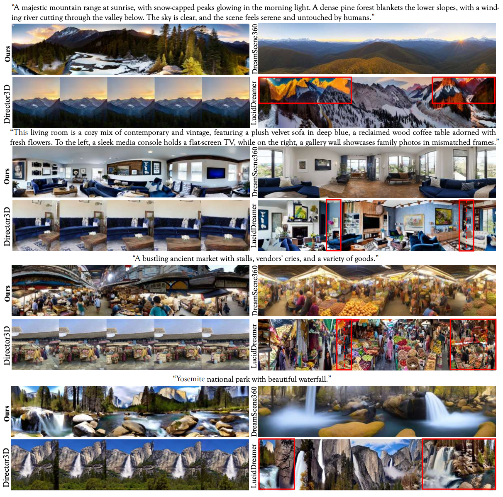

<!-- <p align="center">
     -->

# CGGS: Consistency-Augmented Geometric Gaussian Splatting for Ego-centric 3D Scene Generation (TIP 2026)
**[Zhenyu Sun](https://zhenyusun-walker.github.io/)**, [Xiaohan Zhang](https://github.com/Xiaohan-Z/), [Qi Liu](https://drliuqi.github.io/)$\uparrow$, [Huan Wang](https://huanwang.tech/)$\uparrow$

[[`Project Page`](https://cggs-26.github.io/cggs26/)] [[`Paper`]()]

## Overview
This repo contains the implementation of CGGS, a new framework for ego-centric 3D scene generation from textual description. With the novel insight in MV-LDM and 3D Gaussian optimization, our method surpasses previous counterparts in terms of semantic alignment, perceptual quality, and rendering fidelity when producing realistic, domain-free 3D scenes.


<p align="center">

</p>

## Key Results

<div align="center">
<table align="center" cellpadding="4">
<thead>
<tr>
<th rowspan="2">Method</th>
<th rowspan="2">3D Representations</th>
<th colspan="5">Generation Quality</th>
<th colspan="3">Reconstruction Quality</th>
</tr>
<tr>
<th>CLIP Score ↑</th>
<th>Sharp ↑</th>
<th>Color ↑</th>
<th>Resolution ↑</th>
<th>Q-Align ↑</th>
<th>PSNR ↑</th>
<th>SSIM ↑</th>
<th>LPIPS ↓</th>
</tr>
</thead>
<tbody>
<tr>
<td>Text2Room</td>
<td>Mesh</td>
<td>24.732</td>
<td>0.215</td>
<td>0.210</td>
<td>0.231</td>
<td>0.697</td>
<td>20.915</td>
<td>0.844</td>
<td>0.169</td>
</tr>
<tr>
<td>LucidDreamer</td>
<td>3DGS</td>
<td><em>25.736</em></td>
<td>0.216</td>
<td><em>0.211</em></td>
<td>0.224</td>
<td>0.764</td>
<td>25.667</td>
<td>0.824</td>
<td>0.163</td>
</tr>
<tr>
<td>Director3D</td>
<td>3DGS</td>
<td>24.996</td>
<td><strong>0.221</strong></td>
<td><strong>0.225</strong></td>
<td><em>0.232</em></td>
<td>0.754</td>
<td>-</td>
<td>-</td>
<td>-</td>
</tr>
<tr>
<td>DreamScene360</td>
<td>3DGS</td>
<td>25.022</td>
<td><em>0.219</em></td>
<td>0.204</td>
<td><strong>0.239</strong></td>
<td><em>0.828</em></td>
<td><em>32.587</em></td>
<td><em>0.969</em></td>
<td><em>0.0477</em></td>
</tr>
<tr>
<td><strong>CGGS</strong></td>
<td><strong>3DGS</strong></td>
<td><strong>26.253</strong></td>
<td>0.218</td>
<td><em>0.211</em></td>
<td>0.231</td>
<td><strong>0.839</strong></td>
<td><strong>37.345</strong></td>
<td><strong>0.977</strong></td>
<td><strong>0.0193</strong></td>
</tr>
</tbody>
</table>
</div>

<strong>Quantitative comparison of generation and reconstruction quality.</strong>
We compare our method with representative text-to-3D and 3D scene generation methods.
As shown, <strong>CGGS</strong> achieves the best performance on CLIP Score, Q-Align, PSNR, SSIM, and LPIPS,
demonstrating superior generation and reconstruction quality.
The <strong>best</strong> results are highlighted in bold, and the <em>second-best</em> results are shown in italic.

<p align="center">

</p>

<strong>Qualitative comparison between CGGS with other baselines.</strong>
CGGS produces multi-view images with rich detail and superior semantic coherence, showcasing domain‑agnosticity. 
Our results outperform other works with an accurately detailed description and unified 3D consistency.
Specifically, DreamScene360 generates visual results with less major content in the horizon field; 
While Director3D is capable of depicting the content described in text prompts, it is constrained by a limited field of view; LucidDreamr causes undesirable style transfer, wrong stitches between concepts, and inconsistent content, as highlighted in the red box.


## Environment Set up
1. Clone this repo:
```
git clone https://github.com/CGGS-26/CGGS.git
cd CGGS
```

2. Create the environment and install dependencies.
```bash
conda create -n CGGS python=3.10.14 -y
conda activate CGGS
pip install -r requirements.txt
pip install MVRec/submodules/diff-gaussian-rasterization
pip install MVRec/submodules/simple-knn
```

3. Prepare the dependencies for LayoutDecorator.
```bash
cd LayoutDecorator
pip install -r requirements.txt

```

## Runnig Code
### Ego-centric Generator
Ego-centric generator can be called via following commands:
```bash
cd MVGen # make sure you are under the CGGS/MVGen

# Default Example
python generate.py --gen_video --save_frames \[Other options\]
python select_range.py --source ./outputs/$results --target ../generate_mvimages
```

**\[Other Options\]** include:
- `--fov` : Denote the horizontal field of camera view, 90 in degrees as default.
- `--deg` : Specify the rotation angle around the vertical axis, 45 in degrees as default.
- `--prompt_folder` : Path to the text file containing the prompts including different scenes. 

If you are in the root directory of the project, just simply run 
```bash
bash scripts/generate.sh
```


Now the project structure should be like:
```text
CGGS/
  ├── MVGen/
  │   ├── generate.py
  │   ├── select_range.py
  │   ├── outputs/
  │   │   └── <results_1>/
  │   └── weights/
  └── generate_mvimages/
      │── <results_1>/
      │    └── <scene_1>/
      │        └── images/
      └── ...
```


Specifically, you need to download the checkpoint from [here](https://drive.google.com/drive/folders/1eZCBBg8ROFLDBtok4PLvgJNZVAC2q49M), and then put it under ```MVGen/weights/pano/last/```.

To fine-tune the pano-generation model with our proposed **consistency-augmented loss**, please download data from [matterport3D](https://niessner.github.io/Matterport/) skybox data and [labels](https://www.dropbox.com/scl/fi/recc3utsvmkbgc2vjqxur/mp3d_skybox.tar?rlkey=ywlz7zvyu25ovccacmc3iifwe&dl=0).

Then you can follow 

To use your own data, please also follow the organization as follows: 
```text
CGGS/
  └── MVGen/
      └── data/
          └── mp3d_skybox/
              ├── train.npy
              ├── test.npy
              ├── 5q7pvUzZiYa/
              │   ├── blip3/
              │   └── matterport_skybox_images/
              ├── 1LXtFkjw3qL/
              └── ...
```

### Layout Decorator
```bash
cd ../flowmap
python3 -m flowmap.overfit dataset=images dataset.images.root=../generate_mvimages/$results/$scene/images
```

Pre-trained checkpoint for LayoutDecorator can be found [here](https://drive.google.com/drive/folders/1xSK-cBj4mzyPI_TncliGyDkbHQGRN37S), and should be organized under ```CGGS/LayoutDecorator/checkpoints/```. 

To train your own, download the [RealEstate-10k](https://google.github.io/realestate10k/index.html) and [CO3Dv2](https://github.com/facebookresearch/co3d), and then run the commands below, following [flowmap](https://github.com/dcharatan/flowmap):
```bash
cd LayourDecorator
python3 -m flowmap.pretrain
```

### Geometric Refiner
```bash
cd ../MVRec
python train.py -s ../flowmap/outputs/local/colmap/ --name $scene
```
Then you can check the rendered images, metrics and the gaussian pointclouds in 
```
MVRec/rendered_images  
MVRec/metrics  
MVRec/output
``` 

<!-- ## Citation
If you find our work helpful, please consider citing:
```bibtex
@article{sun2026cggs,
        title     = {CGGS: Consistency-Augmented Geometric Gaussian Splatting for Ego-centric 3D Scene Generation},
        author    = {Zhenyu Sun and Xiaohan Zhang and Qi Liu and Huan Wang},
        journal   = {IEEE Transactions on Image Processing},
        year      = {2026},
      }
``` -->
